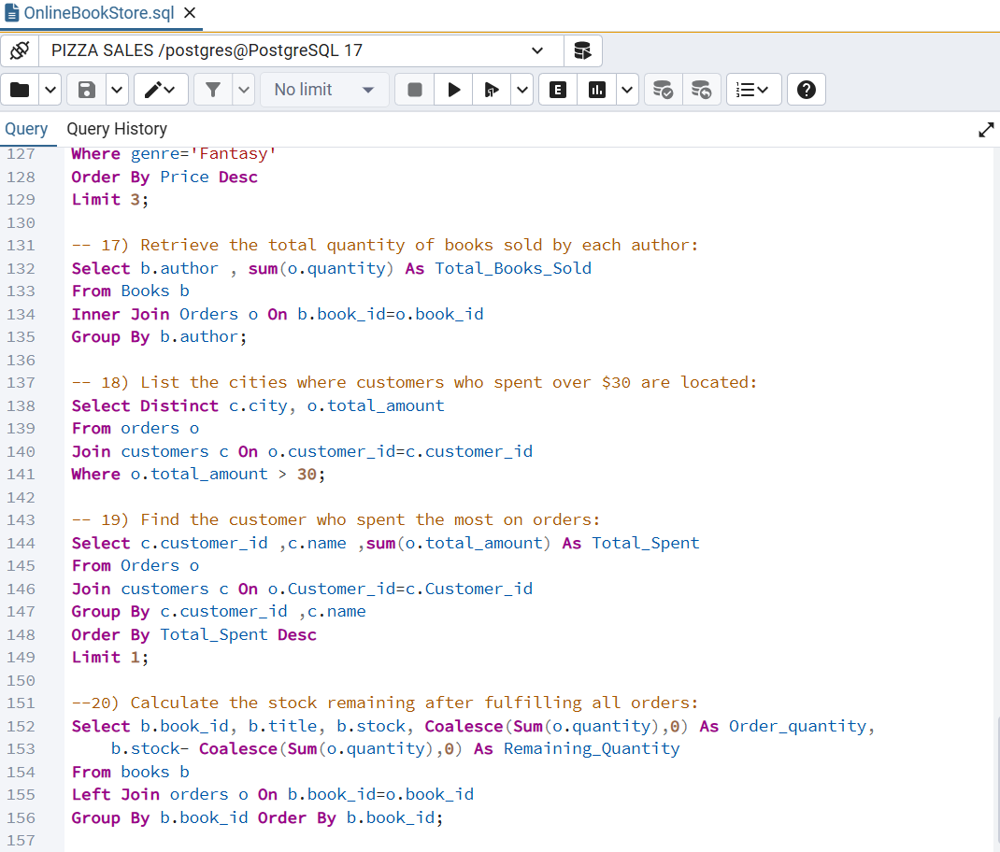

# SQL Data Analysis – Online Bookstore

**Tools:** SQL, pgAdmin 4, CSV datasets

---

## Project Overview
This project focuses on analyzing an online bookstore dataset to extract actionable business insights. The dataset consists of three CSV files: **Books.csv, Customers.csv, and Orders.csv**, which were imported into pgAdmin 4. Relational tables were created with primary and foreign keys, enabling comprehensive analysis of sales, inventory, and customer behavior.

---

## Key Highlights & Skills Demonstrated
* **Database Design & Management:** Created normalized tables with relationships and ensured data integrity.  
* **Data Import & Preparation:** Imported CSV files and prepared data for analysis.  
* **Querying & Analysis:**  
  * Retrieved and filtered data (e.g., books by genre, customers by country, orders by month)  
  * Aggregated data to calculate totals, averages, and revenue  
  * Performed advanced queries to identify top-selling books, frequent customers, and inventory updates  
* **Business Insights:** Provided actionable intelligence to support inventory planning, marketing strategies, and sales optimization.

---

## Example Queries Implemented
* Retrieve all books in the "Fiction" genre  
* Find books published after 1950  
* List customers from Canada  
* Show orders placed in November 2023  
* Calculate total stock of books available  
* Identify most expensive and least stocked books  
* Find total revenue and books sold per genre  
* Determine top spending customers and customer cities with high orders  

---

## Project Screenshot

---

## Outcome
This project demonstrates the ability to transform raw relational data into meaningful insights, highlighting proficiency in SQL querying, data aggregation, and relational database management. It bridges technical database skills with business decision-making capabilities.
